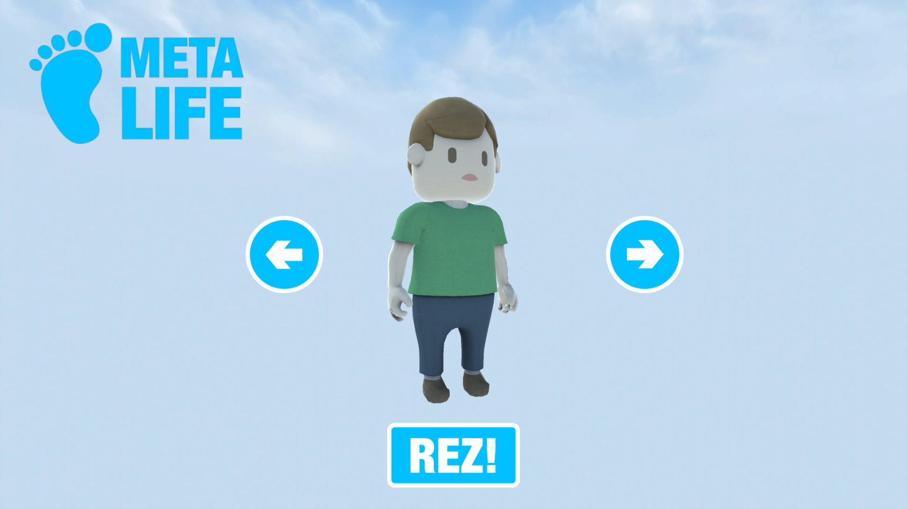
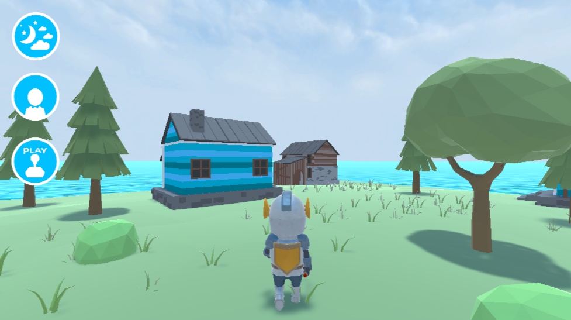
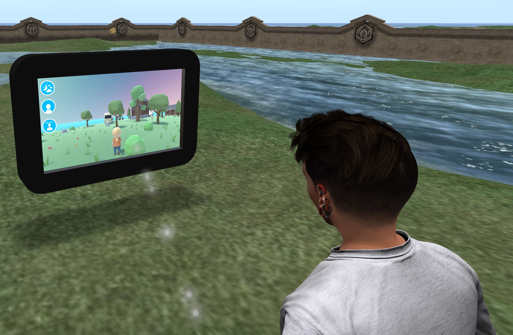

# MetaLife
## Plain metaverse experience built in Unity v2020.3.27f1

This is a mini-game made with Unity and published in webgl, intended to be used inside metaverses like Second Life.

Written in C#
 
_App hosted on Github Pages in this repository (WebGL)_

**You can launch the app from here: [./webgl/index.html](https://realjck.github.io/metalife/webgl/)**

_(please note that this version is optimized for small screens, and therefore the size of the UI may seem inappropriate when viewed on a computer.)_
  

The game is made with the following assets:
* UNITY TECHNOLOGIES - Newbie & Friends
* JUSTCREATE - Low-Poly Simple Nature Pack
* IOAN STAN - Low Poly Mini Village Free
* ARKHAM INTERACTIVE - Toony Skies
* JEAN MORENO - Cartoon FX Free
* LOWLYPOLY - Stylize Water Texture
* ASSET ARCHIVE - Sets - Gems

Screenshot of game playing inside Second Life using a Media Texture:

## License
This is free and unencumbered software released into the public domain.

Anyone is free to copy, modify, publish, use, compile, sell, or
distribute this software, either in source code form or as a compiled
binary, for any purpose, commercial or non-commercial, and by any
means.

In jurisdictions that recognize copyright laws, the author or authors
of this software dedicate any and all copyright interest in the
software to the public domain. We make this dedication for the benefit
of the public at large and to the detriment of our heirs and
successors. We intend this dedication to be an overt act of
relinquishment in perpetuity of all present and future rights to this
software under copyright law.

THE SOFTWARE IS PROVIDED "AS IS", WITHOUT WARRANTY OF ANY KIND,
EXPRESS OR IMPLIED, INCLUDING BUT NOT LIMITED TO THE WARRANTIES OF
MERCHANTABILITY, FITNESS FOR A PARTICULAR PURPOSE AND NONINFRINGEMENT.
IN NO EVENT SHALL THE AUTHORS BE LIABLE FOR ANY CLAIM, DAMAGES OR
OTHER LIABILITY, WHETHER IN AN ACTION OF CONTRACT, TORT OR OTHERWISE,
ARISING FROM, OUT OF OR IN CONNECTION WITH THE SOFTWARE OR THE USE OR
OTHER DEALINGS IN THE SOFTWARE.

For more information, please refer to <http://unlicense.org/>